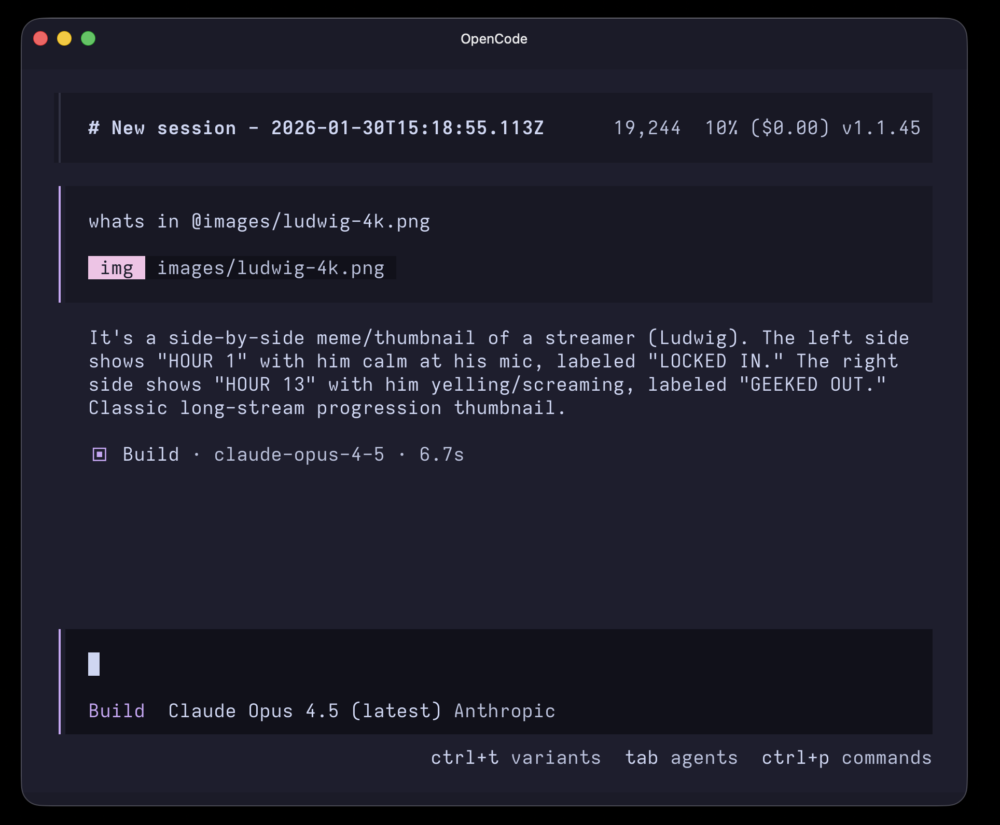

# opencode-image-compress

[OpenCode](https://opencode.ai) plugin that automatically compresses images before sending them to AI providers, preventing "image exceeds maximum" errors.

## Problem

High-resolution images (especially @2x Retina screenshots) often exceed provider size limits, making it impossible to use them in conversations:


## Solution

With the plugin installed, images are automatically compressed before being sent. The same image works seamlessly:




## Installation

Add to your `opencode.json` (global or per-project):

```json
{
	"plugin": ["opencode-image-compress@latest"]
}
```

That's it. OpenCode will automatically install the plugin on next launch.

## How It Works

The plugin compresses images in two scenarios:

1. **Images pasted in chat** - via the `experimental.chat.messages.transform` hook
2. **Images read by the agent** - via the `tool.execute.after` hook when the Read tool returns image attachments

In both cases, it detects the provider and model, and compresses images that exceed provider-specific limits.

### Provider Limits

Verified as of January 2026. Source URLs are in [`src/providers.ts`](src/providers.ts).

| Provider                | Limit   | Target (70%) | Source                                                                                                |
| ----------------------- | ------- | ------------ | ----------------------------------------------------------------------------------------------------- |
| Anthropic               | 5 MB    | 3.5 MB       | [docs](https://platform.claude.com/docs/en/build-with-claude/vision)                                  |
| Amazon Bedrock          | 3.75 MB | 2.6 MB       | [docs](https://docs.aws.amazon.com/bedrock/latest/userguide/conversation-inference-call.html)         |
| OpenAI                  | 20 MB   | 14 MB        | [docs](https://platform.openai.com/docs/guides/images)                                                |
| Azure OpenAI            | 20 MB   | 14 MB        | [docs](https://learn.microsoft.com/en-us/azure/ai-foundry/openai/quotas-limits)                       |
| Google (AI Studio)      | 100 MB  | 70 MB        | [blog](https://blog.google/innovation-and-ai/technology/developers-tools/gemini-api-new-file-limits/) |
| Google Vertex AI        | 7 MB    | 4.9 MB       | [docs](https://docs.cloud.google.com/vertex-ai/generative-ai/docs/models/gemini/2-5-pro)              |
| Google Vertex Anthropic | 5 MB    | 3.5 MB       | (follows Anthropic limits)                                                                            |
| Groq                    | 4 MB    | 2.8 MB       | [docs](https://console.groq.com/docs/vision)                                                          |
| Fireworks AI            | 10 MB   | 7 MB         | [docs](https://docs.fireworks.ai/guides/querying-vision-language-models)                              |
| Perplexity              | 50 MB   | 35 MB        | [docs](https://docs.perplexity.ai/guides/image-attachments)                                           |
| xAI (Grok)              | 20 MB   | 14 MB        | [docs](https://docs.x.ai/docs/models)                                                                 |
| DeepSeek                | 10 MB   | 7 MB         | (community consensus)                                                                                 |
| Mistral                 | 10 MB   | 7 MB         | [docs](https://platform-docs-public.pages.dev/capabilities/vision/)                                   |
| Together AI             | 20 MB   | 14 MB        | (not documented)                                                                                      |
| Other/Unknown           | 5 MB    | 3.5 MB       | (conservative default)                                                                                |

#### Proxy Providers

Providers like `github-copilot`, `opencode`, `github-models`, and `openrouter` proxy to upstream APIs. The plugin resolves the actual provider from the model ID (e.g., `claude-sonnet-4-5` → Anthropic → 5 MB, `gpt-4o` → OpenAI → 20 MB) to apply the correct limit.

### Compression Strategy

1. Skip if already under target (70% of provider limit)
2. Scale down if dimensions exceed 2048px
3. Reduce quality progressively (JPEG/WebP/AVIF)
4. PNG: increase compression level, then shrink dimensions
5. Fallback: aggressive resize to 1024px

### Supported Formats

JPEG, PNG, WebP, AVIF, GIF (converted to PNG), other formats (converted to JPEG).

### Logging

The plugin logs compression activity to OpenCode's app log system (`service: "image-compress"`). View logs in the TUI or via the API.

### Toast Notifications

Set `OPENCODE_IMAGE_COMPRESS_PLUGIN_SHOW_TOAST=1` to show TUI toast notifications when images are compressed or when compression fails.


## Development

```bash
git clone https://github.com/kynnyhsap/opencode-image-compress.git
cd opencode-image-compress
bun install

# Run OpenCode with the plugin loaded from source
bun dev

# Run all checks (format, lint, typecheck, unit tests)
bun check

# Individual commands
bun fmt
bun lint
bun typecheck
bun test:unit
E2E_TESTS=1 bun test:e2e
```

## License

MIT
